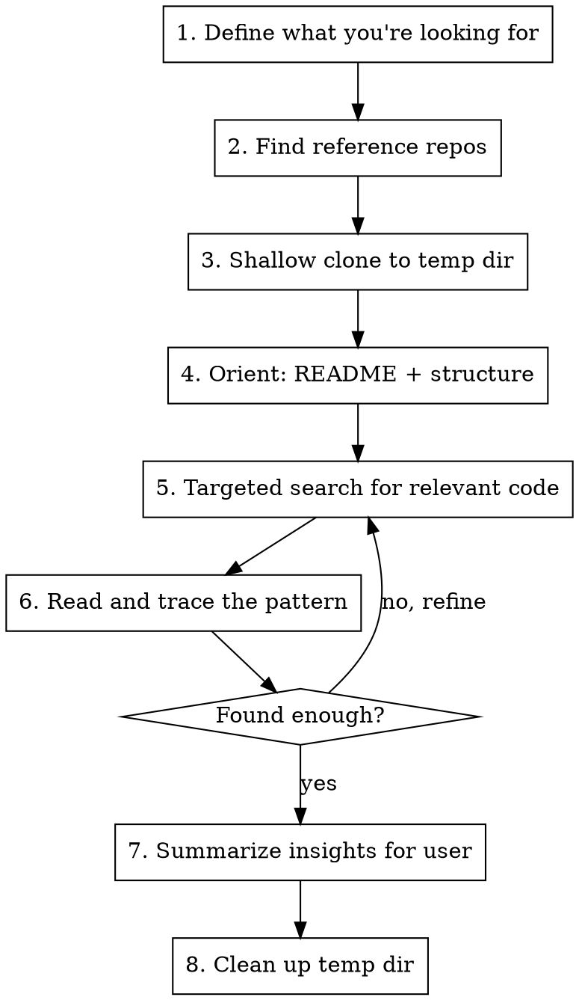

# Exploring Reference Repos

## Overview

Efficiently explore other git repositories to extract architectural patterns and implementation strategies for problems you're currently solving. Clone smart, search targeted, extract insights, clean up after.

## When to Use

- You need to implement something and want to see how a mature project solved it
- The user says "see how X does it" or "look at project Y for inspiration"
- You're choosing between architectural approaches and want real-world examples
- You need to understand a pattern before applying it to the current project

**When NOT to use:**
- Answer is easily found in documentation or a web search
- You already know the pattern well
- The reference project is private or inaccessible

## Core Workflow



## Step 1: Define What You're Looking For

Before cloning anything, articulate clearly:

- **The specific problem** you're trying to solve in the current project
- **What kind of code** you expect to find (e.g., "plugin loader", "IPC protocol", "auth middleware")
- **2-3 search keywords** to use in the target repo

Write these down for the user so they can steer you if you're off-track.

## Step 2: Find Reference Repos

**If the user named a project:** Use it directly. Find the repo URL.

**If you need to find one:** Use GitHub search, prioritizing stars and activity:

```bash
# Search by topic/keywords
gh search repos "<keywords>" --language=TypeScript --sort=stars --limit=5

# Search with more specific queries
gh search repos "plugin system framework" --language=TypeScript --sort=stars
```

**Well-known references for common patterns:**

| Pattern | Good References |
|---------|----------------|
| Plugin/extension system | VSCode, Rollup, Webpack |
| CLI framework | Commander, Yargs, Oclif |
| IPC / message passing | Electron, VS Code |
| Provider/adapter pattern | Passport.js, Keystone |
| Middleware chain | Express, Koa, Hono |
| Task queue / scheduler | Bull, Agenda, BreeJS |
| Config management | Cosmiconfig, RC |
| Sandbox / isolation | vm2, isolated-vm |

**Choose 1-2 repos max.** Depth beats breadth.

## Step 3: Clone Efficiently

**Always shallow clone to a temporary directory. Never clone into the working project.**

```bash
REF_DIR=$(mktemp -d)
git clone --depth 1 --single-branch <repo-url> "$REF_DIR/repo-name"
```

**For very large repos** (monorepos, 500MB+), use sparse checkout:

```bash
git clone --depth 1 --filter=blob:none --sparse <repo-url> "$REF_DIR/repo-name"
cd "$REF_DIR/repo-name"
git sparse-checkout set src/relevant-directory
```

## Step 4: Orient — README + Structure

Spend 2 minutes orienting before diving into code:

1. **Read the README** (or equivalent) to understand project structure and conventions
2. **List top-level directories** to understand the layout
3. **Find the entry point** (main, index, package.json `main` field)
4. **Identify the relevant subdirectory** for what you're looking for

```bash
# Quick structural overview
ls "$REF_DIR/repo-name"
ls "$REF_DIR/repo-name/src" 2>/dev/null || ls "$REF_DIR/repo-name/lib" 2>/dev/null
```

## Step 5: Targeted Search

Use your keywords from Step 1 to find relevant files fast. Use the Grep and Glob tools — they work on any directory, not just the current project.

**Find files by name:**
Use Glob with the `path` parameter set to the cloned repo directory.

**Search code content:**
Use Grep with the `path` parameter set to the cloned repo directory.

**Narrow progressively:**
1. Start broad — find which files mention your keyword
2. Narrow to the most relevant 2-3 files
3. Read those files fully

## Step 6: Read and Trace the Pattern

Once you find the entry point for the pattern you're studying:

1. **Read the core file** that implements the pattern
2. **Follow imports** to understand the abstraction layers
3. **Check types/interfaces** to understand the contract
4. **Look at tests** if the implementation isn't clear — tests often show intended usage
5. **Check for configuration** to understand what's customizable

**Focus on architecture, not implementation details.** You're looking for:
- How they decomposed the problem
- What interfaces/abstractions they created
- How data flows through the system
- What tradeoffs they made

## Step 7: Summarize Insights

Before cleaning up, present findings to the user:

- **Pattern name**: What would you call this approach?
- **How it works**: 2-3 sentence explanation of the architecture
- **Key abstractions**: Interfaces, base classes, or contracts they use
- **Data flow**: How information moves through the system
- **Tradeoffs**: What they optimized for vs. what they sacrificed
- **Applicability**: How this maps (or doesn't) to the current project
- **What to adopt vs. skip**: Concrete recommendation

## Step 8: Clean Up

**Always remove the cloned repo when done:**

```bash
rm -rf "$REF_DIR"
```

If the temp dir variable is lost, find and clean it:
```bash
# macOS temp dirs are in /var/folders or $TMPDIR
ls -d /tmp/tmp.* 2>/dev/null
```

## Quick Reference

| Step | Action | Tool |
|------|--------|------|
| Find repos | Search GitHub | `gh search repos` via Bash |
| Clone | Shallow clone to temp | `git clone --depth 1` via Bash |
| Orient | README + directory layout | Read, Bash `ls` |
| Search files | Find by name pattern | Glob with `path` param |
| Search code | Find by content | Grep with `path` param |
| Read code | Understand patterns | Read tool |
| Clean up | Remove temp directory | `rm -rf` via Bash |

## Common Mistakes

- **Cloning into the project directory**: Always use `mktemp -d`. Never pollute the working project.
- **Deep cloning**: `--depth 1` is almost always sufficient. You don't need history.
- **Aimless browsing**: Have specific questions before exploring. Refine as you go, but always have a target.
- **Exploring too many repos**: 1-2 well-chosen repos beats 5 superficial scans.
- **Copying code verbatim**: Extract *patterns and architecture*, not code. Licenses and context differ.
- **Forgetting cleanup**: Always `rm -rf` the temp directory. Set a mental flag when you clone.
- **Reading everything**: You don't need to understand the whole project. Find the 2-3 files that implement the pattern you care about.
