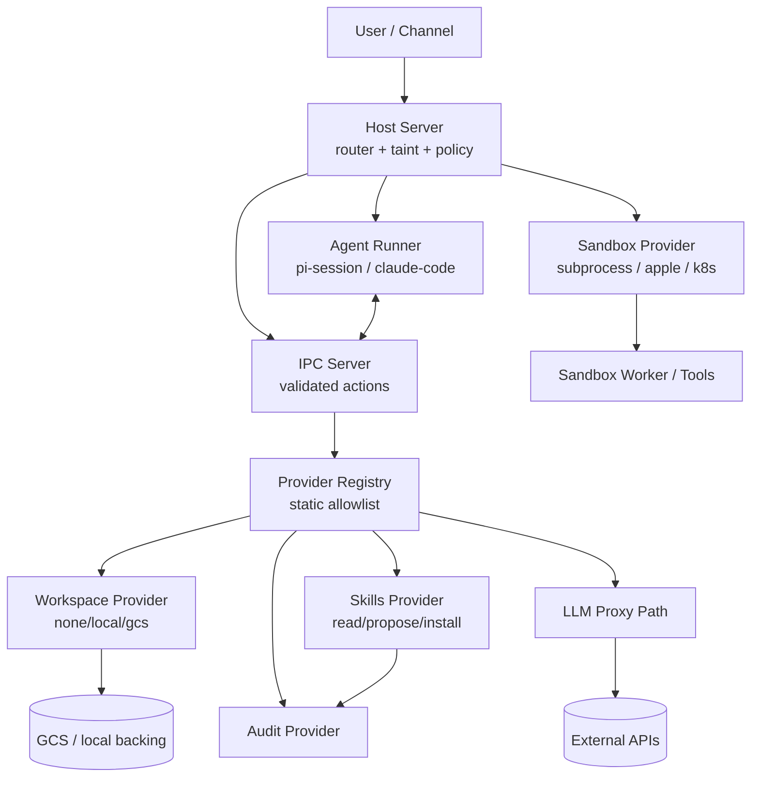

# AX Deep Architecture Docs (Multi-Agent Pack)

This folder is a **downloadable markdown architecture pack** for AX.

We synthesized this as a "multi-agent" document set, where each file acts like a specialist report:

- `agent-1-core-runtime.md` — host, router, provider registry, IPC server
- `agent-2-agent-runtime.md` — agent process, runners, prompt and tools
- `agent-3-sandbox-and-compute.md` — local sandboxes, Apple containers, k8s pods
- `agent-4-workspace-gcs-mounting.md` — workspace provider + GCS mount lifecycle (including Apple vs k8s behavior)
- `agent-5-skills-binaries-network.md` — skill install/execute lifecycle, binary execution, network/proxy behavior
- `data-flow.md` — end-to-end request and workspace/skills flow diagrams

## Architecture diagram (system overview)

## Scope

- Focused on currently implemented behavior in `src/`.
- Includes explicit callouts when a requested behavior is not implemented yet.
- Prioritizes host/agent trust boundaries and data flow.

## Suggested reading order

1. Core runtime
2. Agent runtime
3. Sandbox/compute
4. Workspace/GCS mounting
5. Skills binaries + network/proxy
6. Data flow diagrams
