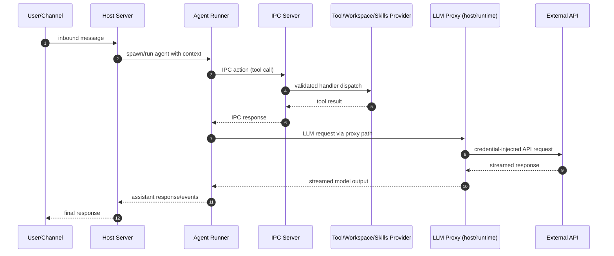
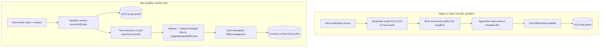
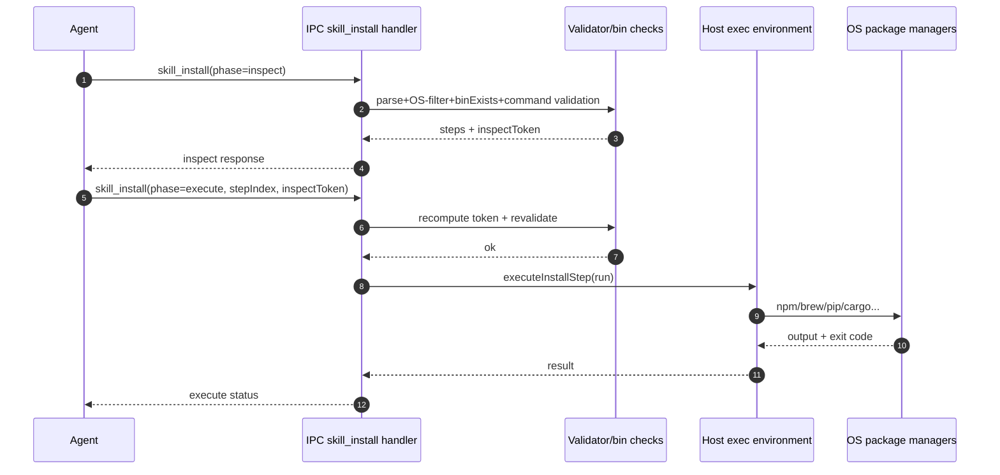

# AX Data Flow Diagrams

## 1) End-to-end request + tool + LLM flow

```mermaid
sequenceDiagram
  autonumber
  participant U as User/Channel
  participant H as Host Server
  participant A as Agent Runner
  participant I as IPC Server
  participant T as Tool/Workspace/Skills Provider
  participant P as LLM Proxy (host/runtime)
  participant X as External API

  U->>H: inbound message
  H->>A: spawn/run agent with context
  A->>I: IPC action (tool call)
  I->>T: validated handler dispatch
  T-->>I: tool result
  I-->>A: IPC response

  A->>P: LLM request via proxy path
  P->>X: credential-injected API request
  X-->>P: streamed response
  P-->>A: streamed model output
  A-->>H: assistant response/events
  H-->>U: final response
```

## 2) Workspace GCS flow (Apple/local transport vs k8s remote transport)

```mermaid
flowchart TB
  subgraph APPLE_LOCAL[Apple or other non-k8s sandbox]
    H1[Host workspace.mount] --> DL1[Download scope from GCS to host cache]
    DL1 --> M1[Bind mount host paths into sandbox]
    M1 --> D1[Agent/tool read-write on mounted dirs]
    D1 --> C1[Host diff/commit pipeline]
    C1 --> G1[(GCS final prefix)]
  end

  subgraph K8S_REMOTE[k8s sandbox worker flow]
    H2[Host sends claim + scopes] --> W2[Sandbox worker provisionScope]
    W2 --> G2[(GCS scope prefix)]
    W2 --> D2[Tool execution in pod canonical mounts]
    D2 --> S2[release -> upload changed files to _staging/requestId/scope]
    S2 --> H3[Host workspace diff/scan/approve]
    H3 --> G3[(Promote to final GCS prefix)]
  end
```

## 3) Skill install flow (inspect -> execute)

```mermaid
sequenceDiagram
  autonumber
  participant A as Agent
  participant I as IPC skill_install handler
  participant V as Validator/bin checks
  participant E as Host exec environment
  participant O as OS package managers

  A->>I: skill_install(phase=inspect)
  I->>V: parse+OS-filter+binExists+command validation
  V-->>I: steps + inspectToken
  I-->>A: inspect response

  A->>I: skill_install(phase=execute, stepIndex, inspectToken)
  I->>V: recompute token + revalidate
  V-->>I: ok
  I->>E: executeInstallStep(run)
  E->>O: npm/brew/pip/cargo...
  O-->>E: output + exit code
  E-->>I: result
  I-->>A: execute status
```
